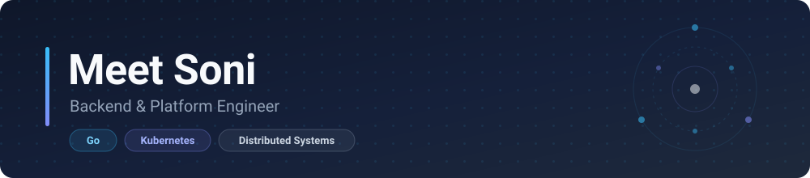
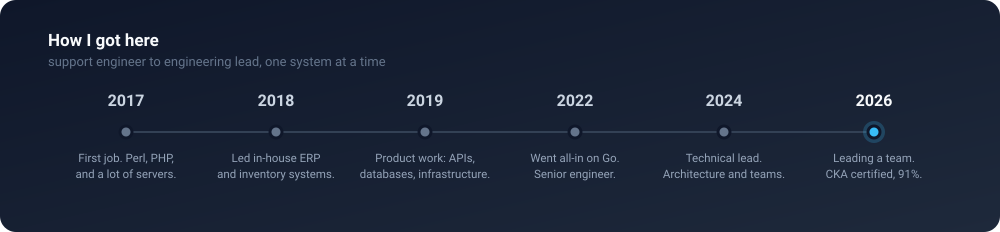
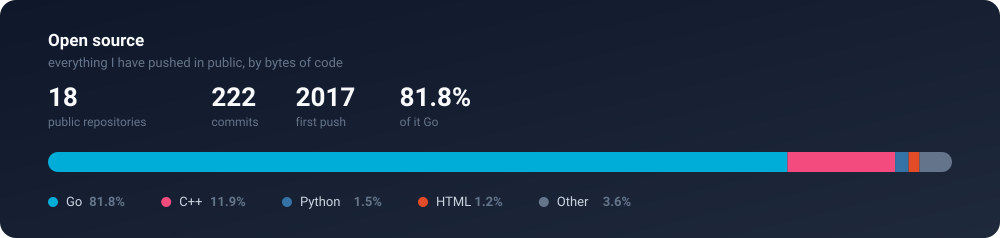
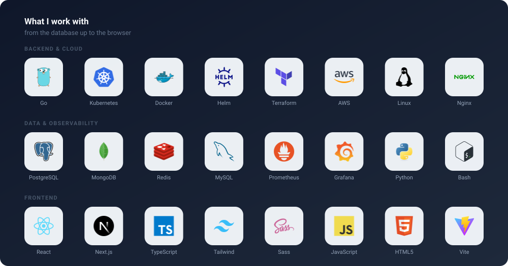

  <a href="https://meetsoni.me"><b>Portfolio</b></a> &nbsp;·&nbsp;
  <a href="https://meetsoni.me/blog"><b>Writing</b></a> &nbsp;·&nbsp;
  <a href="https://www.linkedin.com/in/meetsoni1511"><b>LinkedIn</b></a> &nbsp;·&nbsp;
  <a href="https://www.credly.com/badges/8f8bd291-ef49-442d-9438-1a6b989b2fac"><b>CKA</b></a> &nbsp;·&nbsp;
  <a href="mailto:meet@meetsoni.me"><b>Email</b></a>

 

I write Go — mostly backend services and the infrastructure they run on, plus the occasional
terminal tool for a problem I got tired of having. Certified Kubernetes Administrator. These
days I lead a small team, which means I write less code and think harder about the code that
gets written.

 

 

## Currently building

**[trending-radar](https://github.com/meetsoni15/trending-radar)** — a radar for new GitHub repos
that rebuilds itself every Monday from a GitHub Action. No manual curation: it queries the Search
API for repos created in the last seven days across AI tooling, security, developer tools, and
infrastructure, then rewrites its own README with the results. I got tired of finding good
projects three months late.

## Projects

<table>
<tr>
  <td width="200"><b><a href="https://github.com/meetsoni15/trending-radar">trending-radar</a></b></td>
  <td>Self-updating list of new and trending GitHub repos, refreshed weekly by a GitHub Action</td>
  <td width="150"><code>Go</code> <code>Actions</code></td>
</tr>
<tr>
  <td><b><a href="https://github.com/meetsoni15/gitcinema">gitcinema</a></b></td>
  <td>Step through your git history like a movie — live file changes, author characters, and a timeline scrubber</td>
  <td><code>Go</code> <code>Bubble Tea</code></td>
</tr>
<tr>
  <td><b><a href="https://github.com/meetsoni15/noisemap">noisemap</a></b></td>
  <td>Finds your codebase's riskiest files by combining cyclomatic complexity with git churn, then draws the heatmap in your terminal</td>
  <td><code>Go</code> <code>AST</code></td>
</tr>
<tr>
  <td><b><a href="https://github.com/meetsoni15/Vault-API-Filecoin">Vault-API-Filecoin</a></b></td>
  <td>HTTP API serving unlockable content out of an immutable Filecoin-backed store</td>
  <td><code>Go</code> <code>Filecoin</code></td>
</tr>
<tr>
  <td><b><a href="https://github.com/meetsoni15/go-lambda-scraper">go-lambda-scraper</a></b></td>
  <td>Rotating-IP scraping infrastructure spread across multi-region AWS Lambda</td>
  <td><code>Go</code> <code>Terraform</code></td>
</tr>
<tr>
  <td><b><a href="https://github.com/meetsoni15/Go-Web-Testify">Go-Web-Testify</a></b></td>
  <td>Unit-testing patterns for Go web applications</td>
  <td><code>Go</code> <code>Testify</code></td>
</tr>
<tr>
  <td><b><a href="https://github.com/meetsoni15/Dodge-the-Falling-Blocks">Dodge-the-Falling-Blocks</a></b></td>
  <td>An arcade game, because not everything needs a business case</td>
  <td><code>Go</code> <code>Raylib</code></td>
</tr>
</table>

 

 

## Work I'm proud of

Consolidating **75 Python microservices into one Go monorepo** driven by a single config file.
Building **search across hundreds of millions of records**, with PostgreSQL functions that take
new query shapes without a redeploy. Replacing synchronous job execution with **queue-driven
pipelines** that retry properly and say when they're degrading — instead of after they're down.
Getting **tracing rolled out across every service**, so debugging stopped being archaeology.

 

 

## Writing

- [**Go Internals: The Runtime Deep Dive Most Developers Miss**](https://meetsoni.me/blog/go-internals-runtime-deep-dive) — the M-P-G scheduler, escape analysis, and GC tuning
- [**Advanced Go Concurrency Patterns**](https://meetsoni.me/blog/go-concurrency-patterns-advanced) — worker pools, fan-in/fan-out, and how not to leak goroutines
- [**noisemap — Visualize Your Codebase's Riskiest Files**](https://meetsoni.me/blog/noisemap-codebase-risk-heatmap) — why complexity × churn predicts where bugs live
- [**Dependency Injection in Go**](https://meetsoni.me/blog/go-dependency-injection-patterns) — interfaces, constructors, and when not to bother
- [**Go's `defer` Keyword**](https://meetsoni.me/blog/go-defer-keyword-deep-dive) — LIFO ordering and the argument-evaluation gotcha

 

---

  Always up for a conversation about Go, Kubernetes, or platform architecture — <a href="mailto:meet@meetsoni.me">meet@meetsoni.me</a>

